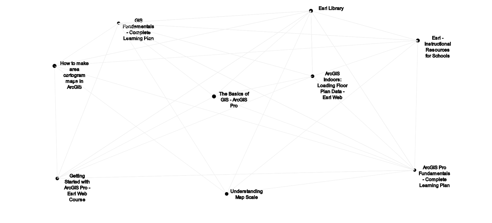

= Educational resources for technical writers

This tool was designed to aid Esri's tech writers in mapping out their own learning plan. The presentation is hybrid between a https://zettelkasten.de/[Zettelkasten] and a mind map. At first glance, the interface for this tool may seem intimidating.

What you see in this diagram are a series of nodes representing different educational resources. The lines between these nodes show the relationship between each node; essentially, when one resource is similar to another's subject matter, a connection is formed. Hovering over a node with your mouse cursor shows these relationships by highlighting the connections in red. The node itself will also glow a color corresponding to its difficulty.

- Red: Most difficult
- Yellow: Moderate difficulty
- Green: Most fundamental

You can rearrange the nodes on the diagram by clicking-and-dragging them around the screen. 